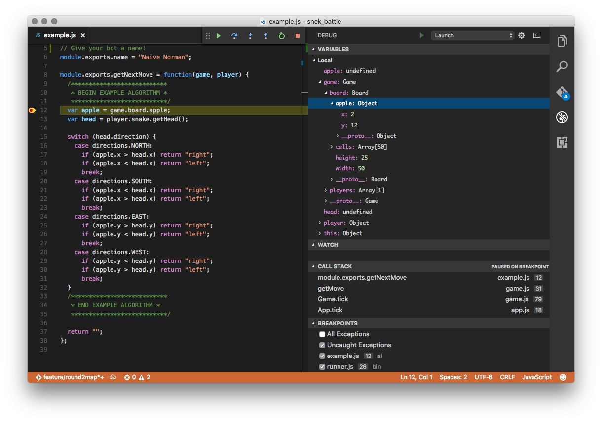

snek: a technical challenge
===========================


Forked from coalman/blessed-life

Getting Started
---------------

### Installation

Clone this repo to a nice spot on your computer. Open a terminal emulator and `cd` to the directory.

If you're on Windows, cmd.exe, PowerShell, and git bash all work fine.
On Mac OSX, Terminal.app will do.

Make sure you have [node.js](https://nodejs.org/en/) properly installed. Then use `npm` to install:

    $ npm install -g

### Running

You can start the program by opening a terminal and entering:

    $ snek

<kbd>a</kbd> turns left. <kbd>s</kbd> turns right.

There are many command line switches that can be used (use `-h` or `--help` for more information). 

To exit the game, press <kbd>esc</kbd> or <kbd>q</kbd>

Challenge
---------

The technical challenge is to make a bot that plays the game of snek. The bot will have information about the whole game board. There are only two moves that can be made: turn left and turn right. The snek will continue moving in a straight line if no move is made.

To submit a solution, email me your implementation. Your solution may not be run against the provided board, so don't make any assumptions!

If I receive three or more submissions I will pit them against each other in an epic snek battle-off. Each bot will play in a playoff-style bracket, with each round being best-of-three games. Ties are discarded.

You may find it useful to use path-finding algorithms for your bot. I encourage you to use PathFinding.js:

http://qiao.github.io/PathFinding.js/visual/

If you're super ambitious, it will be helpful to read about elements of game theory, such as the Nash Equilibrium and Best Response.

### Writing a bot

Start by copying the provided bot, `ai/example.js`. Give it an awesome robot name. The bot must only implement a single function: `getNextMove`. It should return `"left"` to turn left, `"right"` to turn right, or nothing to keep going straight.

The `getNextMove` function is called once per game tick. It receives three parameters: `game`, `player`, and `opponent`. The game object contains the current game state and looks something like:

```json
{
  "board": {
    "width": 50,
    "height": 25,
    "cells": ...,
    "apple": {
      "x": 28,
      "y": 14
    }
  },
  "players": [
    {
      "name": "Naïve Norman",
      "snake": {
        "path": [
          {
            "x": 10,
            "y": 5,
            "direction": "S"
          }
        ]
      },
      "controller": {
        "name": "Naïve Norman"
      },
      "score": 0,
      "status": "ok",
      "color": "green"
    }
  ]
}
```

Cells is a 2D array of cells that represent the fixed parts of the game board. These parts are defined in `Elements.js`. It looks something like:

```json
[
  ["W","W","W","W","W","W","W","W","W","W","W","W","W","W","W","W","W","W","W","W","W","W","W","W","W"],
  ["W","B","B","B","B","B","B","B","B","B","B","B","B","B","B","B","B","B","B","B","B","B","B","B","W"],
  ["W","B","B","B","B","B","B","B","B","B","B","B","B","B","B","B","B","B","B","B","B","B","B","B","W"],
  ["W","B","B","B","B","B","B","B","B","B","B","B","B","B","B","B","B","B","B","B","B","B","B","B","W"],
  ["W","B","B","B","B","B","B","B","B","B","B","B","B","B","B","B","B","B","B","B","B","B","B","B","W"],
  ["W","B","B","B","B","B","B","B","B","B","B","B","B","B","B","B","B","B","B","B","B","B","B","B","W"],
  ["W","B","B","B","B","B","B","B","B","B","B","B","B","B","B","B","B","B","B","B","B","B","B","B","W"],
  ["W","B","B","B","B","B","B","B","B","B","B","B","B","B","B","B","B","B","B","B","B","B","B","B","W"],
  ["W","B","B","B","B","B","B","B","B","B","B","B","B","B","B","B","B","B","B","B","B","B","B","B","W"],
  etc.
]
```

You can dig into the code to see the interfaces of these objects. The `player` parameter represents the "player" that the bot is, whereas the `opponent` parameter is the other player.

### Running the game

Player 1 and player 2 are specified by the first two parameters to snek. `k` is a shortcut for the keyboard. To load a bot, give the filepath to the bot. For example, to play against the a bot:

    $ snek k ai/example.js

To pit a bot against itself:

    $ snek ai/example.js ai/example.js

To load a specific map, use the `--map` option.

    $ snek ai/example.js --map maps/eleven.json

### Debugging

[Visual Studio Code](https://code.visualstudio.com/) has a very good debugger for node.js, and is also a great editor for working on your submission. 


To launch the debugger, download and install Visual Studio Code, open your working copy of snek, then press <kbd>F5</kbd>. Alternatively, open the debugger sidebar and click the green play button. The command line options can be configured in the `.vscode/launch.json` file. See ["Debugging in Visual Studio Code"](https://code.visualstudio.com/Docs/editor/debugging) for more information about debugging.

### Logging and such

`console.log` calls are redirected to the debug window, which can be toggled with <kbd>F12</kbd>, however this method is kind of slow and buggy. To redirect logging to a file instead, use the `--log` option. Internally this uses a [log](https://www.npmjs.com/package/log) instance.

    $ snek ai/example.js --log path/to/log.txt

You can pause the game ticker by passing `-p` (or using the <kbd>p</kbd> key), and then manually advancing the ticks with <kbd>space</kbd>.

    $ snek ai/example.js -p

This can be useful for debugging. Also useful for debugging is modifying the speed at which the game runs. Using the `--speed` flag you can specify the number of milliseconds per game tick.

    $ snek ai/example.js --speed 500

### Rules

Your bot may READ any information provided to it about the game board. It may not:
* Modify any game state.
* Modify any player state.
* Pause or excessively delay the game.
* Attempt to subvert or otherwise sabotage the normal flow of the game.


 
